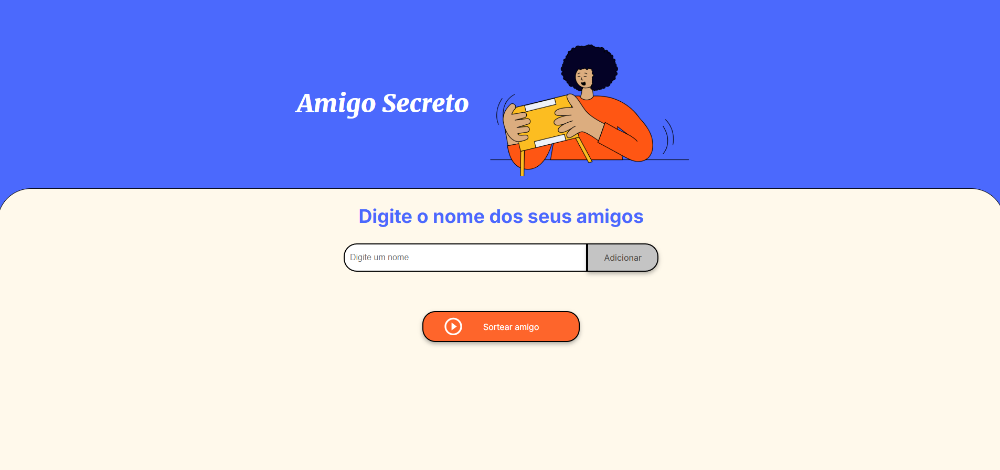

# Amigo Secreto 🎁

Uma aplicação simples e interativa para gerenciar e realizar o sorteio de um amigo secreto! Os usuários podem adicionar nomes a uma lista, visualizar os participantes e realizar um sorteio para determinar quem será o "amigo secreto".

---

## 🛠️ Funcionalidades

- **Adicionar nomes**: Os usuários podem inserir nomes de amigos em uma lista visível.
- **Validar entrada**: Não permite adicionar nomes vazios ou duplicados.
- **Visualizar a lista**: Mostra os nomes já adicionados.
- **Remover nomes**: Cada nome na lista possui um botão para remoção.
- **Sortear amigo secreto**: Escolhe um nome aleatório da lista e exibe o resultado na tela.

---

## 🚀 Tecnologias utilizadas

- **HTML5**: Estrutura do projeto.
- **CSS3**: Estilização e responsividade.
- **JavaScript (ES6)**: Lógica e interatividade da aplicação.

---

## 📂 Estrutura do projeto

amigo-secreto/
index.html        # Estrutura principal da página
style.css         # Estilos visuais
app.js            # Lógica da aplicação

assets/           # Imagens e ícones

---

## 🖥️ Pré-visualização

---

## 📦 Como utilizar

1. Clone o repositório:
   git clone https://github.com/seu-usuario/amigo-secreto.git

2.Acesse a pasta do projeto:
   cd amigo-secreto

3.Abra o arquivo index.html no navegador:
   Clique duas vezes no arquivo ou arraste-o para o navegador.

🌟 Melhorias futuras
Adicionar funcionalidade para salvar a lista de amigos localmente no navegador.
Implementar um design responsivo aprimorado para dispositivos móveis.
Permitir exportar a lista de participantes em um arquivo.

🤝 Contribuições
Contribuições são sempre bem-vindas! Sinta-se à vontade para abrir issues ou enviar pull requests.

### Como usar:
1. Substitua as informações de contato e links por seus dados.
2. Adicione uma imagem de pré-visualização do projeto no diretório `assets` e atualize o nome do arquivo na seção **Pré-visualização**.
